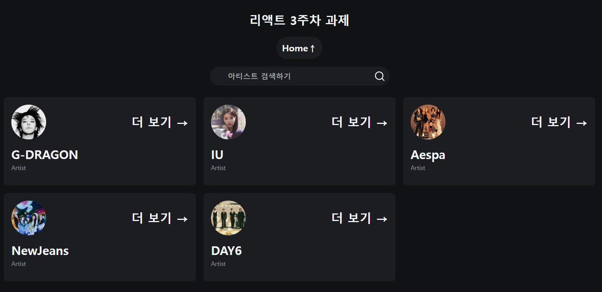
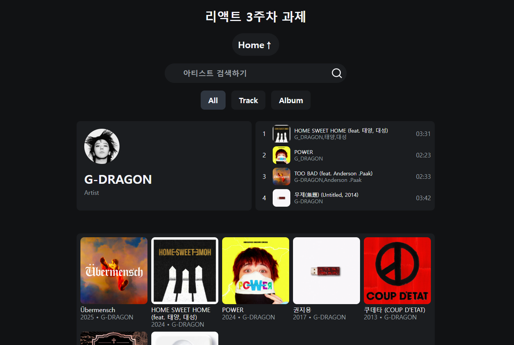

# React 3주차 과제

멋사 프론트엔드 14기 3주차 과제 문서입니다. <br/>
Spotify 사이트의 디자인을 참고하여 과제 수행 하였습니다.

## 목차

- [App.jsx](#appjsx)
- [최종](#최종)
- [3주차 회고](#3주차-회고)

## App.jsx

- `App.jsx`는 프로젝트의 루트 컴포넌트
- 데이터 패칭, 라우팅 상태 관리, 페이지 전환 시 UI를 결정

```jsx
import { useEffect, useState } from 'react';
import ArtistDetail from './components/artist/artist-detail/artist-detail';
import Card from './components/card/card';
import Search from './components/search/search';
import { getData, getSearchData } from './service/data-fetch';
import './App.css';

function App() {
  // 페이지가 처음 로드될 때 URL에서 검색어를 추출
  const initialSearch = decodeURIComponent(window.location.pathname.slice(1));
  // 가수에 대한 데이터 정보 상태 관리
  const [data, setData] = useState(null);
  // 검색어 상태 관리
  const [search, setSearch] = useState(initialSearch);
  // 현재 URL path 상태
  const [path, setPath] = useState(window.location.pathname);
  // 에러 상태 관리
  const [error, setError] = useState(null);

  // 검색어(search)가 변경될 때마다 실행
  useEffect(() => {
    // AbortController를 사용하여 컴포넌트가 언마운트 되거나 검색어가 바뀌면
    // 이전 요청을 취소
    const abortController = new AbortController();

    // 검색어에 따른 비동기 함수 선택
    const fetchFn =
      search === ''
        ? () => getData(abortController.signal)
        : () => getSearchData(search, abortController.signal);

    fetchFn()
      .then((data) => {
        setData(data);
        setError(null);
      })
      .catch((error) => {
        if (error.name !== 'AbortError') {
          console.error(error);
          setError('데이터를 불러오지 못했습니다...');
        }
      });

    return () => {
      abortController.abort();
    };
  }, [search]);

  // 라우팅 상태
  useEffect(() => {
    // 브라우저 뒤로 가기/앞으로 가기 이벤트 감지
    // URL이 변경되면 path 상태를 갱신하여 어떤 화면을 보여줄지 결정 한다.
    const handlePopState = () => {
      setPath(window.location.pathname);
    };

    window.addEventListener('popstate', handlePopState);

    return () => window.removeEventListener('popstate', handlePopState);
  }, []);

  // 새로운 주소로 이동 함수
  const navigate = (to, state = null) => {
    // pushState로 새로운 주소로 이동 후, popstate 이벤트를 실행하여 path상태 업데이트
    window.history.pushState(state, '', to);
    window.dispatchEvent(new PopStateEvent('popstate'));
  };

  // 조건부 렌더링
  // '/' => Card 리스트 컴포넌트 페이지 렌더링
  // '/가수,아티스트 명' => ArtistDetail 페이지 렌더링(상세 페이지)
  return (
    <section className="app">
      <h1>리액트 3주차 과제</h1>
      <a className="home-link" href="/">
        Home↑
      </a>
      <Search setSearch={setSearch} search={search} navigate={navigate} />

      {error && <p className="error">{error}</p>}

      {path === '/' ? (
        <Card artists={data} search={search} path={path} navigate={navigate} />
      ) : (
        <ArtistDetail
          name={decodeURIComponent(path.slice(1))}
          data={history.state || data}
        />
      )}
    </section>
  );
}

export default App;
```

## 최종




## 3주차 회고

처음 3주차 과제 안내 문서를 확인 후 구현하고자 했던 기능들은 완성한것같아 뿌듯한 시간 이었습니다. 특히 기존 리액트 페이지 라우팅 경우 React Router Dom과 같은 라이브러리를 활용하여 구현 해보았는데 브라우저API만으로 구현하여 더 재미있었던 시간이었습니다.<br/> 다만 더미 데이터를 준비하는 데에 많은 시간이 소요가 되면서 쫓기듯이 코드 작성한것과 접근성 측면에서 많은 고민을 하지 못했던 점이 아쉬웠던것 같습니다.<br/> 과제 제출하고 끝이 아니라 여유가 생길 때마다 접근성, 코드 리팩토링 등 계속 고민하여 수정해 나가야 할 것 같습니다.
